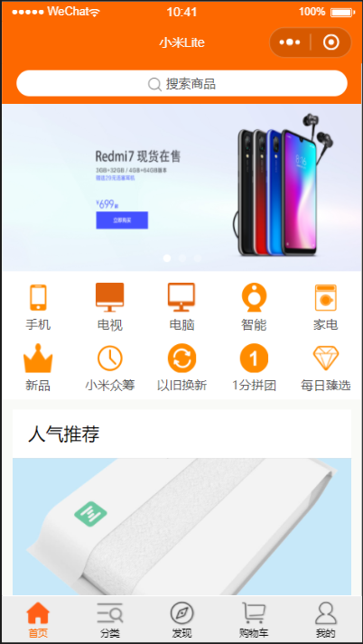
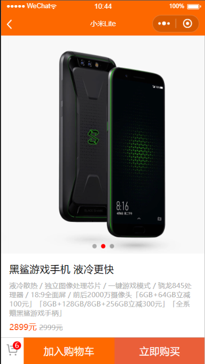
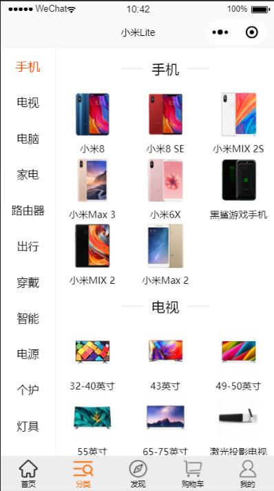
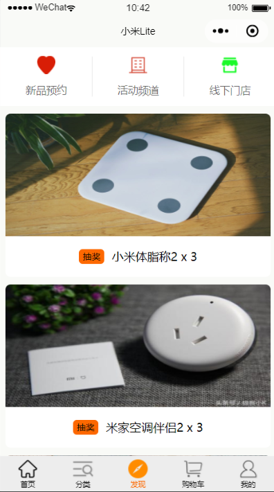
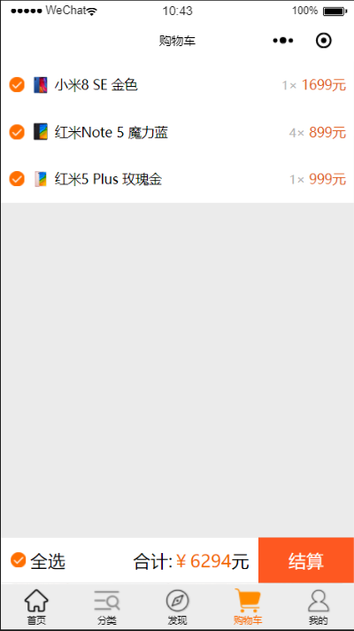
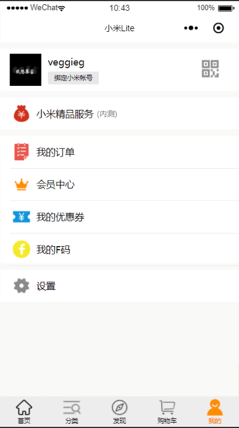
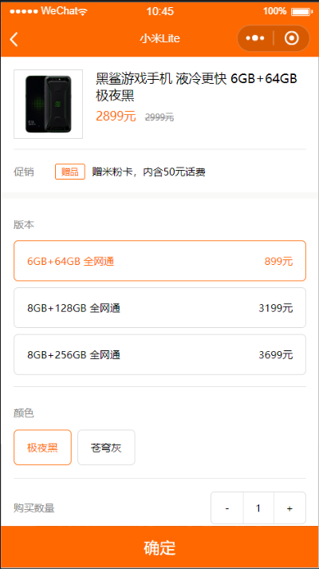
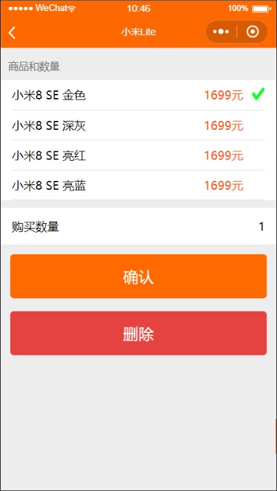

# 仿小米商城微信小程序

1. 项目历时10天完成。用来巩固小程序所学知识。没有云开发，所有数据通过本地数据和EasyMock模拟 
2. 该项目具有商城小程序的基本功能，即商品展示，商品详情。购物车，订单操作等。

# 项目截图和录屏

## 项目截图

<figure class="half">
    
    
    
    
    
    
    
    
</figure>

## 项目录屏

<figure class="half">
    <h3>tabbar操作</h3>
    
    <h3>购物车和订单操作</h3>
    
</figure>

